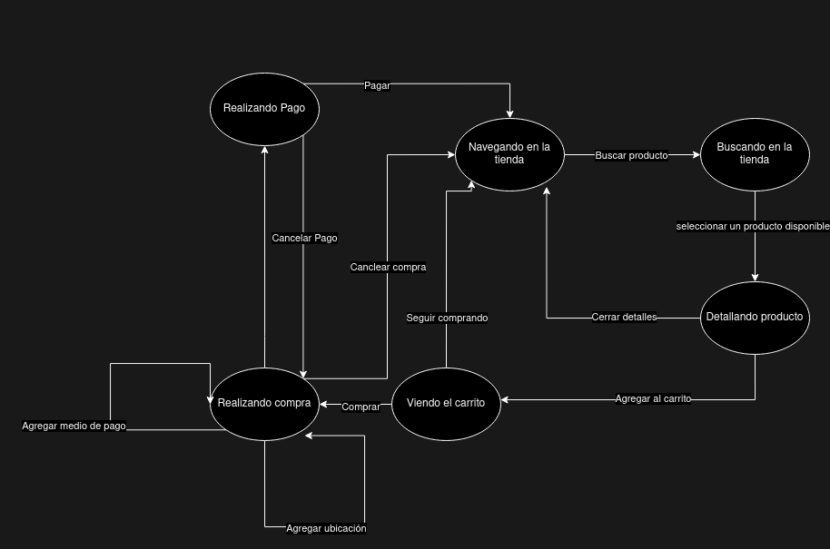

# Analisis historia de usuario: Compra de Producto en una Tienda en Línea

## Diagrama: Árbol de desición

## Diagrama: Transición de estados

## Partición de Equivalencia:

### Casos válidos:

- El usuario busca un producto existente
- El usuario agrega productos al carrito
- El usuario completa la información de pago y envío

### Casos inválidos:

- El usuario busca un producto inexistente
- El usuario intenta agregar una cantidad negativa de productos al carrito
- El usuario proporciona información de pago incorrecta

## Valores Límite o Frontera:

- Carrito vacío
- Carrito con 1 producto
- Varios productos en el carrito
- Ubicacion de envío a distancia cercana
- Ubicacion de envío a distancia lejana

## Casos de prueba gherkin

- [Añadir al carrito](./features/add_to_cart.feature)
- [Compra de productos](./features/buy_products.feature)
- [Busqueda de productos](./features/search_by_name.feature)

## Conslusión

Las pruebas se diseñaron cubren las principales funcionalidades de la historia de usuario, asegurando la calidad al reducir la posibilidad que se presenten fallos en producción
